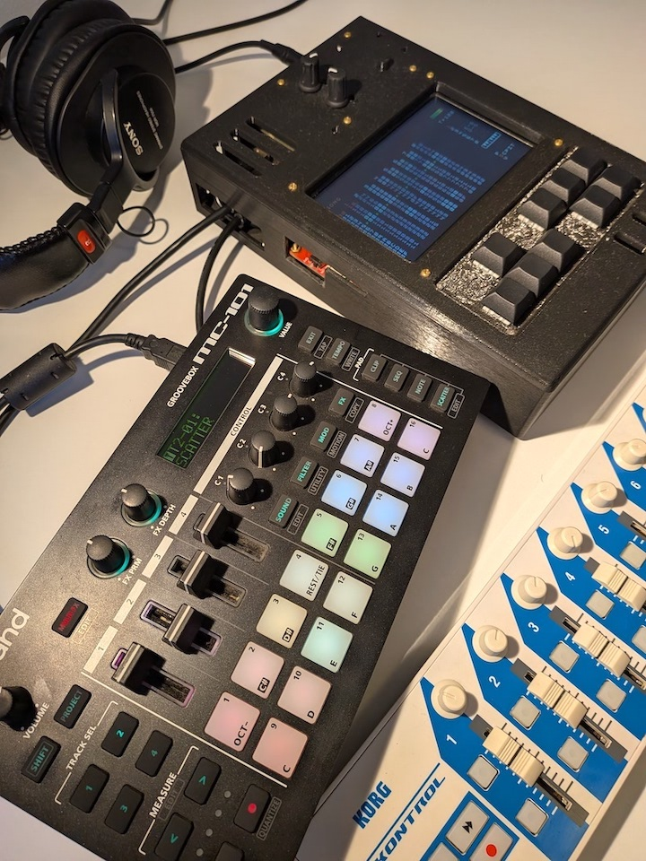
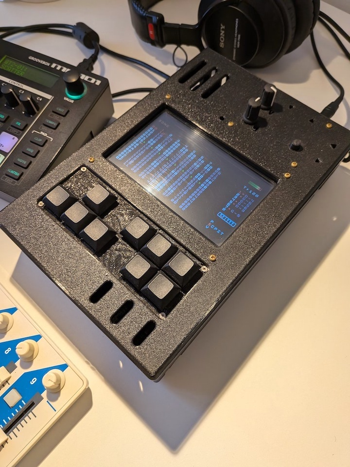
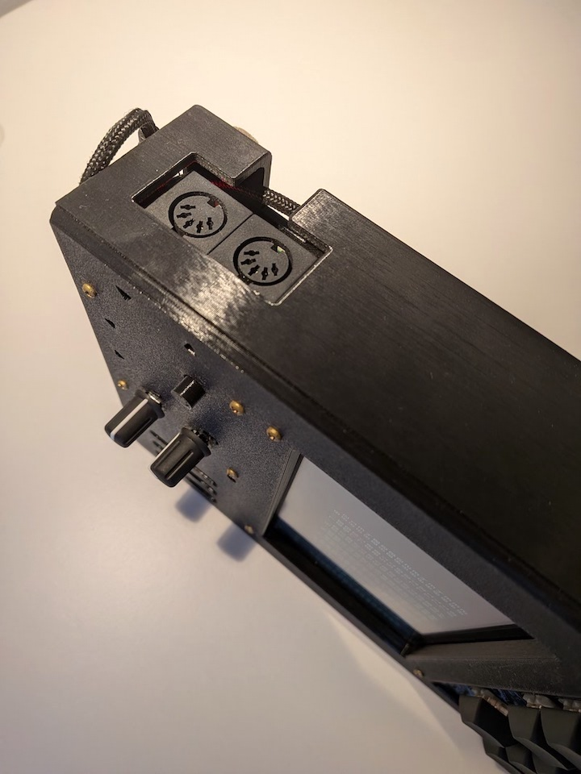
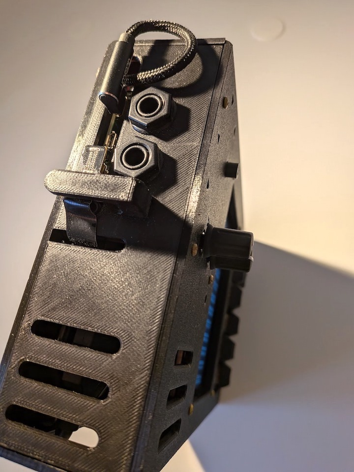

# Table of contents

- [About](#about-this-project)
- [Installation](#installation)
- [Settings](#recommended-settings)
- [Usage](#usage)

# About this project

## Overview

The mc101-pisound started as an idea for a portable device to add audio input to the Roland MC-101, using a Raspberry Pi 4 and Blokas Pisound. It has since grown into a broader performance and control environment for the MC-101.

Alongside audio routing between the MC-101, Pisound and M8C, it provides a HUD overlay and extended Korg nanoKONTROL mappings for scene launching, scale-based playing and editing of several MC-101 parameters of drum tracks and tone partials.

I will not cover the hardware requirements or build details here. However, I am happy to discuss ideas for this project. Meanwhile, you can see some pictures below:

| Full setup | M8C enclosure | MIDI in & out | Audio in & out |
|---|---|---|---|
|  |  |  |  |

You can find more pictures [here](https://github.com/RowdyVoyeur/mc101-pisound/blob/main/images).

## Related resources

Since the Roland MC-101 is a central part of this project, you may find useful the [MC-101 tips and tricks website](https://sites.google.com/view/rolandmc101) I created, covering shortcuts, workflow notes and useful information for this groovebox.

If you also use a Dirtywave M8 or M8 Headless, I have put together a separate [M8 shortcuts, tips and tricks website](https://sites.google.com/view/m8tracker/) with additional notes for this tracker.

## Acknowledgements

This project could not exist without [Timothy Lamb](https://github.com/trash80)'s phenomenal invention, the [Dirtywave M8 Tracker](https://dirtywave.com/products/m8-tracker-model-02), and I am especially grateful for the creation of such an inspiring instrument and for making M8 Headless available to the community.

Thank you very much to [laamaa](https://github.com/laamaa) for creating [M8C](https://github.com/laamaa/m8c), which is an essential part of this project.

Thanks also to [DrKnackerator](https://github.com/DrKnackeratorStrikesAgain/) for the support and excellent tools, including [Roland-Zen-Decode-XML](https://github.com/DrKnackeratorStrikesAgain/Roland-Zen-Decode-XML).


## Compatibility

M8C is a client for [Dirtywave M8](https://dirtywave.com/) headless mode. While the original [application](https://github.com/laamaa/m8c) is cross-platform and can be built for Linux, Windows, macOS and Android, **this repository is optimised and tested exclusively for the Raspberry Pi 4 running 64-bit Bookworm** and is tailored for integration with the Roland MC-101 and Pisound.

>It is recommended to use M8 Headless Firmware [6.2.1](https://github.com/Dirtywave/M8HeadlessFirmware/blob/main/Releases/M8_V6_2_1_HEADLESS.hex) or earlier. Newer versions, such as 6.5.1 G or 6.5.2 C are known to have MIDI sync issues with external gear when used with Pisound.

# Installation

## 1. Install Patchbox OS

Download and install [Raspberry Pi Imager](https://www.raspberrypi.com/software/).

Download and unzip [Patchbox OS 2024-04-04 (Bookworm ARM64 Debian)](https://dl.blokas.io/patchbox-os/2024-04-04-Patchbox.zip).

Insert the SD card to your computer's card reader, launch Raspberry Pi Imager and follow the steps to flash Patchbox OS.

After flashing, safely remove the SD card, insert it into your Raspberry Pi and power it on.

Connect your computer to the same Network as the Raspberry Pi (using an ethernet cable to connect the RPi to the network), open a Terminal window and paste the following after boot is complete (default password: `blokaslabs`).

```
ssh-keygen -R patchbox.local
ssh patch@patchbox.local
```

## 2. Configure Patchbox OS

During the [first run](https://blokas.io/patchbox-os/docs/first-run-options/), follow the instructions of the [Setup Wizard](https://blokas.io/patchbox-os/docs/setup-wizard/):

- If prompted, start by updating Patchbox OS;

- Then, for security reasons, change the default password;

- Select Pisound as the default sound card;

- Use the following audio settings: `Sampling Rate` of 48,000 Hz, a `Buffer Size` of 64 and a `Period` of 4;

- Choose the boot environment `Console Autologin`;

- If you intend to use it, configure Wi-Fi;

- Select `None: Default Patchbox OS Environment` to disable modules.

Once the Setup Wizard is finished, type `patchbox` to enter the `Patchbox Configuration Utility` and do the following:

- Stop Bluetooth, disable Wi-Fi hotspot and disconnect Wi-Fi;

- Go to `kernel` and select `install-rt switch te current kernel to realtime one` to enable the RT kernel.

Reboot with ```sudo reboot```, login with ```ssh patch@patchbox.local``` and return to the `Patchbox Configuration Utility` to confirm the RT kernel has been installed. Go to `kernel` and look for `It's a realtime kernel`.

## 3. Install dependencies

Install the libraries required by SDL3 and m8c:

```
sudo apt update
sudo apt install -y \
  build-essential cmake git pkg-config \
  libusb-1.0-0-dev \
  libudev-dev libdbus-1-dev \
  libegl1-mesa-dev libgles2-mesa-dev libdrm-dev libgbm-dev \
  libasound2-dev libjack-jackd2-dev libfreetype-dev
```

## 4. Download and configure SDL3

Run the following to clone SDL3:

```
cd ~
# If the folder already exists, just enter it; otherwise, clone.
[ -d "sdl3" ] || git clone --depth 1 https://github.com/libsdl-org/SDL.git sdl3
cd sdl3
mkdir -p build && cd build
```

Then, use this command which tells SDL3 to use the hardware acceleration of the Pi 4 and the low-latency audio of Patchbox:

```
cmake -DCMAKE_BUILD_TYPE=Release \
      -DSDL_UNIX_CONSOLE_BUILD=ON \
      -DSDL_VIDEO_DRIVER_KMSDRM=ON \
      -DSDL_X11=OFF \
      -DSDL_WAYLAND=OFF \
      -DSDL_OPENGL=OFF \
      -DSDL_OPENGLES=ON \
      -DSDL_ALSA=ON \
      -DSDL_JACK=ON \
      -DSDL_PULSEAUDIO=OFF ..
```

## 5. Compile and install SDL3

Run the following to compile and install SDL3:

```
make -j4
sudo make install
sudo ldconfig
```

Run this command to see if the system can find the SDL3:

```
pkg-config --modversion sdl3
```

## 6. Install TrueType font

The M8 visual overlay requires the TrueType Font add-on to draw text. Run the following to download and compile it:

```
cd ~
git clone --depth 1 https://github.com/libsdl-org/SDL_ttf.git
cd SDL_ttf
mkdir -p build && cd build
cmake -DCMAKE_BUILD_TYPE=Release ..
make -j4
sudo make install
sudo ldconfig
```

## 7. Install mc101-pisound

Clone mc101-pisound repository with the following commands:

```
cd ~
git clone https://github.com/RowdyVoyeur/mc101-pisound.git
cd mc101-pisound
```

And then, run the build with:

```
make clean
make
```

## 8. Install the Patchbox Module

To run everything automatically and manage the audio/MIDI routing, [install](install.sh) the custom [Patchbox Module](patchbox-module.json) included in this repository.

This installation script will automatically configure the required USB udev rules for the M8, so you do not need to set them manually.

Run the following command to install the module:

```
patchbox module install https://github.com/RowdyVoyeur/mc101-pisound
```

## 9. Test the application

Reboot and use the following command to run the application:

```
cd mc101-pisound
./m8c
```

Test the application, ensuring both the display and audio are working correctly. If everything is OK, proceed to the last step. Otherwise, review the installation before moving forward.

## 10. Final configurations

Quit the application, and edit `config.ini` with the following command:

```
cd /home/patch/.local/share/m8c/
sudo nano config.ini
```
Ensure `fullscreen`is set to `true`, and save the file (Ctrl+X, Y, Enter).

Lastly, activate the Patchbox Module with the following command:

```
patchbox module activate mc101-pisound
```

> If you wish to deactivate the module, run `patchbox module deactivate`.

# Recommended settings

For the nanoKONTROL integration to work correctly, install [nanokontroller.nktrl_set](assets/nanokontroller.nktrl_set) on the Korg nanoKONTROL. The [nanokontroller.py](scripts/nanokontroller.py) script is started automatically at launch whenever a nanoKONTROL is detected.

>The nanoKONTROL mappings can be customised using the information in [config-guide.md](scripts/config-guide.md), together with the Roland MC-101 System Exclusive message notes documented in [mc101-sysex.md](scripts/mc101-sysex.md).

It's also recommended to use the [M8 template song](assets/TEMPLATE.m8s) included in the repository’s [assets](assets/) folder.

The following additional settings are recommended to ensure full integration between the nanoKONTROL, MC-101 and M8C:

| Device | Section | Setting | Value |
|---|---|---|---|
| MC-101 | System (CTRL) | USB Drv | VENDOR |
| MC-101 | System (MIDI) | Sync Src | USB |
| MC-101 | System (MIDI) | Sync Out | ON |
| MC-101 | System (MIDI) | SyncOut USB | ON |
| MC-101 | System (MIDI) | RX StartStop | ON |
| MC-101 | System (MIDI) | RX Start USB | ON |
| MC-101 | System (MIDI) | Ctrl Ch | CH13 |
| MC-101 | System (MIDI) | Ctrl Tx OUT | ON |
| MC-101 | System (MIDI) | Ctrl Tx USB | ON |
| MC-101 | System (MIDI) | Ctrl Rx | ON |
| MC-101 | System (MIDI) | Rx Scatter | ON |
| MC-101 | Tempo | MstrStepLen | 16 (same as M8) |
| M8 | Project | Live Quantize | 10 (16 steps) |
| M8 | MIDI | Sync In | Transport |
| M8 | MIDI | Sync Out | Clock |
| M8 | MIDI | Rec. Note Chan | 14 |
| M8 | MIDI | CC Map Chan | 16 |
| M8 | MIDI | Song Row Cue Ch | 15 |

# Usage

## Starting and stopping

Once the Patchbox module has been activated, everything starts automatically at boot. `m8c.sh` detects which devices are connected, starts the JACK audio bridges, launches the M8C display and then starts the helper scripts:

- `scripts/pc2note.py` starts when the MC-101 is detected
- `scripts/nanokontroller.py` starts when a nanoKONTROL is detected

> Quitting M8C shuts the Raspberry Pi down. This is intentional, so the unit can be powered off safely without a terminal. To stop the module without shutting down, run `patchbox module deactivate`.

To run it manually instead, use `cd mc101-pisound && ./m8c`.

## The HUD

The overlay drawn on top of the M8C display shows the current preset and scene, and the last parameter you touched with its name and value. When you change preset or scene it briefly shows the title and the controls available in that scene, so you can see what the current layer does without a printed reference.

## nanoKONTROL presets and scenes

Presets are selected on the nanoKONTROL with a two-button combo. Hold the prefix button, then press a selector button within 2 seconds:

- Presets 1 to 4: hold **Rewind**, then Up, Down, Left or Right
- Presets 5 to 8: hold **Fast Forward**, then Up, Down, Left or Right

The four selector buttons also send M8 cursor movement when pressed on their own. Pressing them as part of a preset combo suppresses the cursor movement.

Scenes are switched using the nanoKONTROL's own scene control. The controller broadcasts its scene change over SysEx and mc101-pisound follows it, updating the HUD and the active mappings. Selecting a preset resets to its first scene.

The Korg nanoKONTROL is organised into 8 [presets](scripts/nanokontroller.py), each containing one or more scenes:

| Preset | Devices | Scenes | Name | Description |
|---:|---|---:|---|---|
| 1 | M8 & MC-101 | 1 | Controller | M8 button controls and MC-101 transport controls |
| 2 | M8 & MC-101 | 1 - 2 | Scenes 01 to 16 | Launch MC-101 scenes 01 to 16 and respective M8 rows |
| 2 | M8 & MC-101 | 3 | Scale Keyboard | Scale-based keyboard control with selectable MIDI channel, scale, key, velocity, and octave |
| 2 | M8 & MC-101 | 4 | Audio Routing | HUD reference for the available audio-routing options |
| 3 | M8 | 1 | Mixer | M8 mute, solo, volume, and CC controls |
| 3 | M8 | 2 - 4 | Performance 1 to 3 | M8 CC performance controls |
| 4 | M8 | 1 - 4 | Keyboard CH 5 to CH 8 | M8 keyboard control on MIDI Channels 5 to 8 |
| 5 | MC-101 | 1 - 4 | DRUM T1 to T4 | MC-101 drum editor for Tracks 1 to 4 |
| 6 | MC-101 | 1 | Common & Oscillator | MC-101 partial common, oscillator, structure |
| 6 | MC-101 | 2 | Filter & Envelope | MC-101 filter, amp envelope, pitch envelope |
| 6 | MC-101 | 3 | LFO 1/2 | MC-101 LFO 1 and LFO 2 controls |
| 6 | MC-101 | 4 | Matrix 1-4 | MC-101 modulation matrix controls for Matrix slots 1-4 |
| 7 | MC-101 | 1 - 4 | Scatter & CH 1 to CH 4 | MC-101 scatter pads and MIDI Channels 1 to 4 CC controls |
| 8 | MC-101 | 1 - 4 | Keyboard CH 1 to CH 4 | MC-101 keyboard and CC controls on MIDI Channels 1 to 4 |

## Audio routing

The Pisound button cycles through eight JACK [audio-routing presets](pisound-btn/audio_routing.sh). One click advances to the next mode. Preset 2, Scene 4 shows the same list on the HUD as a reference while you cycle.

Hold the Pisound button for 1 second to reset the routing, and for 3 seconds to reboot.

| Press | Route |
|---|---|
| 1 | M8 → MC-101 |
| 2 | M8 + Pisound In → MC-101 |
| 3 | MC-101 + M8 → Pisound Out |
| 4 | MC-101 → M8 → Pisound Out |
| 5 | Pisound In → MC-101 → M8 → Pisound Out |
| 6 | Pisound In → MC-101 + M8 → Pisound Out |
| 7 | Pisound In → M8 → MC-101 → Pisound Out |
| 8 | Pisound In → MC-101 Left / M8 → MC-101 Right |
